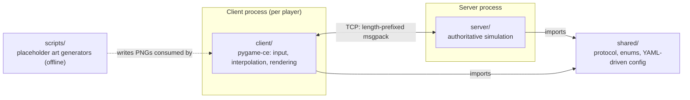
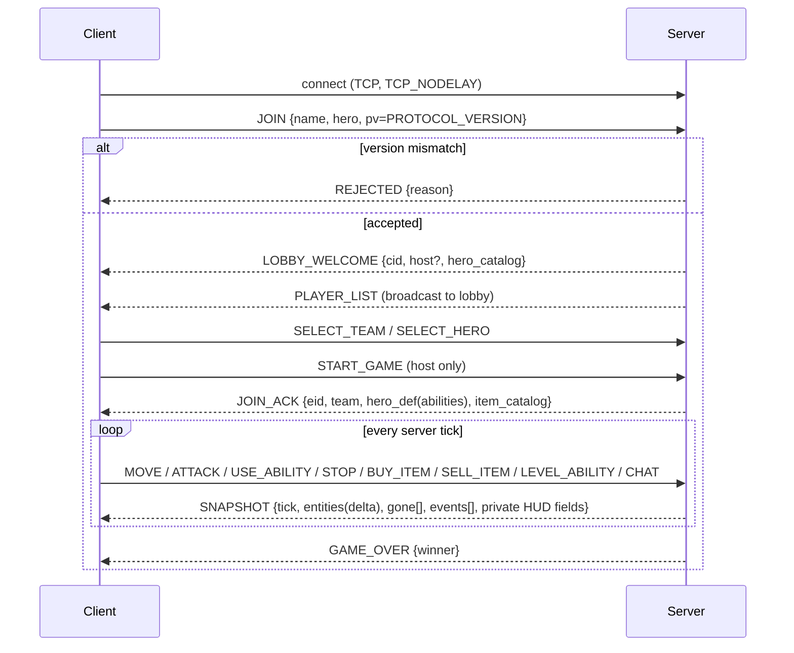
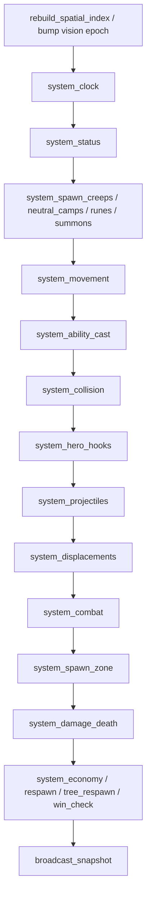
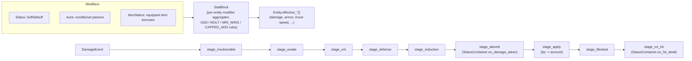
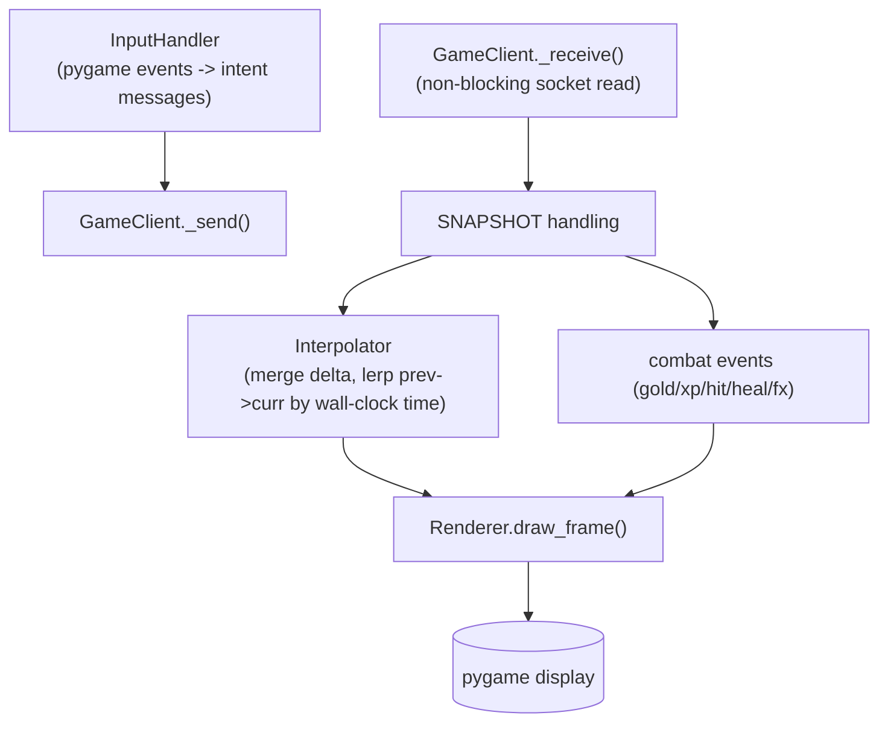

# Architecture

This document explains how project-gameph fits together: the client-server split, the server's per-tick simulation pipeline, the stat/status/damage system, and how heroes/items are authored. For gameplay rules and controls, see [README.md](README.md).

## Overview

project-gameph is an **authoritative-server** MOBA. The server (`server/`, asyncio) owns all game state and simulates the match at a fixed tick rate; clients (`client/`, pygame-ce) send input as intent messages and render whatever the server tells them is true. Each client holds a single TCP connection carrying length-prefixed msgpack frames (`shared/protocol.py`). The client runs **no gameplay logic** — no collision, no damage math, no cooldown authority — it only captures input, interpolates between the last two server snapshots for smooth motion, and draws the result. This means cheating by patching the client can't affect the match, and it's also why adding a hero or item never requires a client code change: ability metadata and item data are sent over the wire and rendered generically.

## Module map

`shared/` is the only thing both processes depend on: message/type enums and the config layer compiled from `config/*.yaml`. `scripts/` is a build-time concern — it generates placeholder sprites into `client/assets/`; it never runs alongside the game.

## Client-server message flow

`JOIN_ACK` is where the client "learns" the game: hero ability metadata (`Ability.describe()` — key, name, cooldown, mana, cast type, range) and the item catalog arrive as data, and `client/input_handler.py` / `client/renderer.py` use that data to build the ability bar and targeting UX. No hero-specific code lives in the client.

Each `SNAPSHOT` is **delta-compressed** (only entities that changed since the client's last acknowledged snapshot are included, plus a `gone` id list) and **split into public/private fields**: every client sees public fields for all visible entities (position, hp, name, level, kills/deaths/assists...), but only the owning client's snapshot includes that hero's private HUD fields (cooldowns, inventory, gold, full stat panel). This roughly halves bandwidth on top of the delta compression, and prevents one client from reading another player's cooldowns/inventory off the wire.

## Server boot & connection handling

`GameServer.start()` (`server/server_main.py`) first calls `validate_all()` (heroes) and `validate_items()` so a broken hero/item definition fails fast at boot rather than mid-match, then opens `asyncio.start_server(...)` and spawns the game loop as a background task.

Each incoming connection gets a `ClientHandler` (`server/net_handler.py`) wrapping the `StreamReader`/`StreamWriter`, with `TCP_NODELAY` set to avoid Nagle-induced input latency. Each handler runs its **own read-pump task** that decodes complete frames into a per-client inbox as bytes arrive — this is a deliberate isolation choice: a single slow or malicious client blocked on I/O cannot stall the shared tick loop, since the loop only ever drains already-decoded messages from each handler's inbox rather than reading sockets itself.

## The server tick loop

The game loop (`GameServer._game_loop`) runs at a fixed timestep. Each tick: drain client inboxes → dispatch messages by `MsgType` (mutating `GameState` or queuing work) → clean up disconnects → if the match is `PLAYING`, run `systems.step(state, dt)` → broadcast snapshots → sleep out the remaining tick budget.

`systems.py` is **not** a class-based ECS — it's a flat module of `(state, dt) -> None` functions run in a fixed order by `step()`. Adding a new mechanic is "write a function, add one line to `step()`," which keeps ordering explicit and auditable instead of buried in scheduler priorities.

Notes on key stages:
- **Spatial index** (`GameState.rebuild_spatial_index`/`nearby`, `server/game_state.py`) — a 512-unit grid bucket rebuilt once per tick; `find_attack_target` and other proximity queries use it instead of scanning every entity (this was a measured 14x speedup, per the netcode/perf history in project memory).
- **Vision cache** (`GameState.visible_ids_cached`) — per-team fog-of-war (line-of-sight against wall/tree geometry) computed once per tick and reused both by combat targeting and by the final snapshot broadcast.
- **`system_ability_cast`** drains queued `USE_ABILITY`/item-active/TP casts, builds a `CastContext`, and calls the hero's ability function — this is the bridge into hero-authored Python (see below).
- **`system_damage_death`** drains queued damage/heal events into `damage.resolve()` (the damage pipeline, see below), then handles kills: gold/XP reward, hero hooks, Manananggal chain-kill logic, terrain-bind release.

## Stat / status / damage pipeline

This is the core "numbers" layer, and the one place where a hero's ability, an item passive, and a rune buff all funnel through the same machinery instead of special-cased branches.

- **`StatBlock`** (`server/stats.py`) is a per-entity aggregator keyed by opaque source tokens (usually a `Status` instance), so a modifier can be added and later removed precisely — including duplicate stacks of the same item — without incremental bookkeeping bugs. `STAT_SPECS` declares, per stat name, how contributions combine (additive, multiplicative, "strongest wins," capped-additive).
- **`Status` / `StatusContainer`** (`server/status/base.py`) model every temporary or persistent effect uniformly: a buff has a stacking policy (refresh/stack/ignore/strongest), a `modifiers` payload that feeds `StatBlock`, a `flags` payload for boolean CC state (stun, silence, invisible, ...), and lifecycle hooks (`on_apply`, `on_tick`, `on_expire`, `on_damage_taken`, `on_hit_dealt`, `on_kill`). `Aura` is a `Status` variant whose payload is conditional (e.g. Kapre's tree-proximity passives) rather than fixed at application time.
- **`damage.py`** resolves one hit as a `DamageEvent` run through an ordered `STAGES` pipeline — invulnerability check, evasion, crit, armor (`DEF/(DEF+K)` curve), flat reduction, absorb (shields / `on_damage_taken` hooks, which is how a shield or a damage-amplify status intercepts the number), HP application, lifesteal, then `on_hit_dealt` hooks. Any stage can cancel the event. This replaced an earlier dict-based buff system (per project history) specifically so that behaviors like shields, evasion, and on-hit effects are ordinary `Status` subclasses instead of ad hoc conditionals scattered through combat code.

## Hero & item authoring pattern

Heroes and items follow the same one-file, auto-discovered pattern:

- **Discovery**: `server/heroes/__init__.py` and `server/items/__init__.py` use `pkgutil.iter_modules` to import every module in the package and register any `HeroDef`/`ItemDef` subclass defined in it. **Adding a hero or item is dropping one file — there is no central registry list to edit**, and discovery deliberately checks the class was defined in the scanned module (not just imported into it) so re-exports can't cause double registration.
- **Abilities as decorated methods**: `@ability(key, name, cd, mana, cast=..., ...)` on a `HeroDef` method (`server/heroes/base.py`) tags it with metadata; `__init_subclass__` collects all tagged methods into `cls.abilities` in definition order and validates uniqueness. `Ability.describe()` produces the wire-safe metadata (no code) sent in `JOIN_ACK`. Items use the identical mechanism via `@item_active`.
- **`HERO_HOOKS`** is the closed set of optional lifecycle callbacks a hero may implement: `on_tick`, `on_ability_cast`, `on_spawn`, `on_death`, `on_level`, `on_attack`, `on_hit_dealt`, `on_damage_taken`, `on_kill`. `systems.fire_hero_hook` dispatches these generically so a hero's passive logic doesn't need special-casing in `systems.py`.
- **`server/skills.py`** is the library ability bodies compose from — projectiles, hooks/grapples, dashes/blinks, AoE/targeted damage, status application, pulse/toggle/summon patterns. An ability function typically calls a handful of these and returns whatever they created for further customization, rather than reimplementing projectile motion or AoE queries per hero.
- **Items** mirror this with `bonuses` (flat stat modifiers, applied as an `ItemStatus`), an optional `passive` (a `Status` subclass, same hook machinery as hero passives), and optional actives. `items.resync(hero, state)` rebuilds all of a hero's `item:`-sourced statuses from their inventory on every buy/sell — this trades a little redundant work for making inventory/status drift structurally impossible.
- **`server/heroes/validation.py`** statically scans each hero's ability code (via `ast`) for calls that name an art asset (projectile/effect names) and checks the matching folder exists under `client/assets/`, so a missing sprite is caught at boot/test time instead of rendering nothing silently at runtime.

## Shared config & protocol

Gameplay constants are authored in YAML (`config/{game,combat,economy,minions,neutrals,structures,map}.yaml`), not Python. `shared/_config_gen.py` compiles the flat YAML files into a generated `_config_constants.py` (literal `NAME = value` assignments, so IDEs can jump to a constant's definition), which `shared/config.py` imports and augments with derived values (tick duration, map center, mirrored Team 2 positions, lane/jungle/rune tables). `ensure_fresh()` regenerates automatically when a YAML file's mtime changes. Net effect: balance changes are YAML edits, not code edits.

`shared/protocol.py` defines the wire format: a 4-byte big-endian length prefix followed by a msgpack payload, capped at 16 MB as a sanity bound. `PROTOCOL_VERSION` is sent by the client on `JOIN`; a mismatch gets an explicit `REJECTED` message rather than a silent desync — this was a deliberate fix after an earlier 2-byte header design could overflow in large matches. `shared/game_types.py` holds the enums both processes share: `MsgType`, `Team`, `EntityType`, `GamePhase`, `CastType`.

## Client architecture

`GameClient` (`client/client_main.py`) is a small state machine (menu → lobby → game) that owns the raw socket, an `Interpolator`, and a `Renderer`. Each frame: process input into intent messages and send them, drain and dispatch inbound messages, ask the `Interpolator` for the current (interpolated) entity set, update the camera, and render.

`Interpolator` (`client/interpolation.py`) owns "the merged world": it applies delta snapshots onto its current world dict (or replaces it wholesale on a `full` snapshot), and on every render frame linearly interpolates each entity's position between the previous and current snapshot using wall-clock elapsed time against the server's tick duration — this is what makes motion look smooth despite the server only updating state once per tick.

`Renderer.draw_frame()` (`client/renderer.py`) draws terrain/entities/fog-of-war/HUD/chat each frame, and separately turns the snapshot's `events` array (gold/xp/hit/heal/fx) into floating combat text and hit-feedback animation — this is how the client visualizes server-authoritative outcomes (a kill, a heal, a crit) without computing them itself.

## Reconnect & resilience

Disconnecting mid-match **parks** a hero (`GameState.remove_hero(keep_for_reconnect=...)`) instead of deleting it; reconnecting with the same player name reclaims the same entity with level, gold, and items intact (disconnects during the lobby phase, before a match starts, do delete normally). Version-mismatched clients are rejected at `JOIN` with a readable reason instead of being allowed to desync. `tests/test_integration.py` and `tests/test_netcode.py` exercise this behavior end-to-end over real sockets and are the most reliable place to see the exact client-server contract in action if this document goes stale.

## Asset generation

`client/assets/` art can be regenerated from code: `scripts/gen_*.py` modules (auto-discovered and run by `scripts/gen_all.py`) use a shared `spritelib.py` toolkit to procedurally draw placeholder sprites, effect frame sequences, and terrain tiles at the exact paths the game expects. Dropping a hand-made PNG at the same path overrides the generated placeholder with no code change required.
